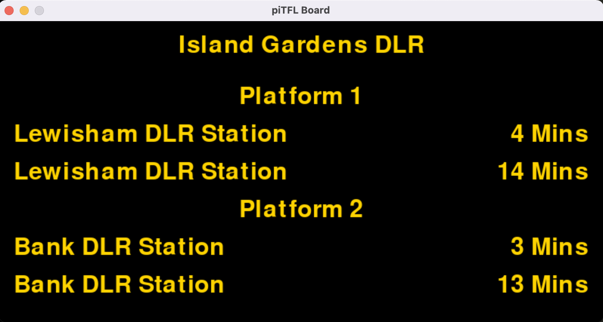
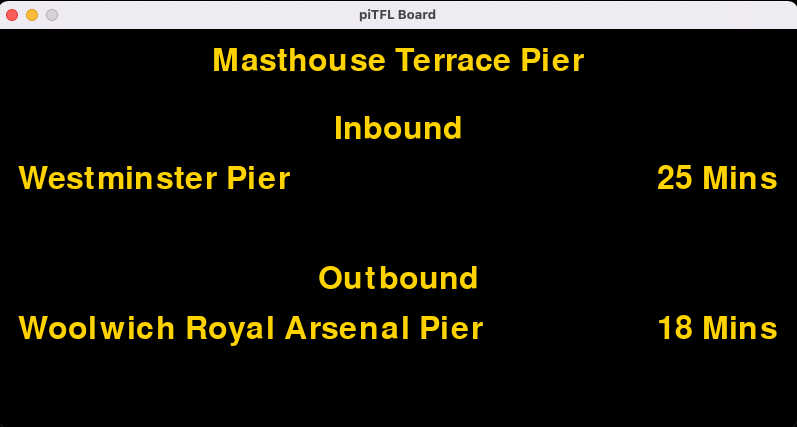

# piTFL_display - Raspberry Pi TFL Display

## About
This replicates the black and yellow LED signs you see on stations and their platforms for the next few trains arriving. The piTFL display renders this using the [TFL API](https://api.tfl.gov.uk) and renders this with [pyGame](https://www.pygame.org/news). 

**For your average tube station:**

**For a boat pier**

## Pros
 - Can determine the rate of API calls.
 - look and feel is good enough to run on a pi connected to a TV.

## Cons
 - Waiting done with `pygame.time.wait()` which sleeps the program.
 - Abstraction and class creation needed for other types of stations, piers and bus stops
 - lots of variable assignment which can be reduced ..... somehow.